# 实验五 Kibana 操作

### 学院：省级示范性软件学院

### 题目：《实验五 Kibana 操作》

### 姓名：文靖铭

### 学号：2200770074

### 班级：软工2201

### 日期：2024-11-11

### 实验环境： elasticsearch-8.12.2   kibana-8.12.2

## 一、实验目的：

### 掌握Elasticsearch Kibana 操作方法

## 二、实验内容：

### 使用Kibana完成elasticsearchExperiment3中的10道题制作仪表盘
***要求：***

***1. 使用elasticsearchExperiment3中的数据。***

***2. elasticsearchExperiment3中的10道题每道一个仪表盘。***

***3. 使用各种各样的仪表盘。***

***

***在之前的elasticsearchExperiment3中创建过ecommerce索引。检查ecommerce是否存在：***
### 查看索引--

### 示例图片--
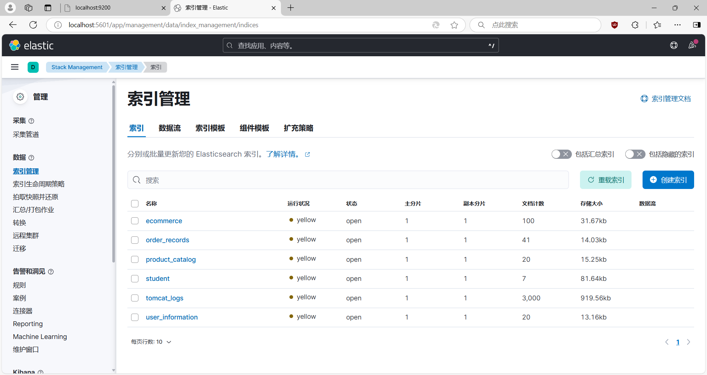

***
### 创建 Data Views

### 示例图片--
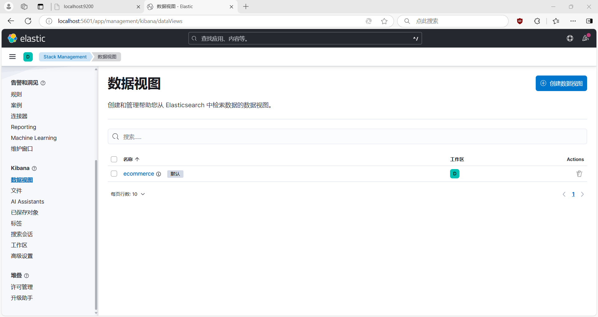

### 创建 Dashboard

### 示例图片--
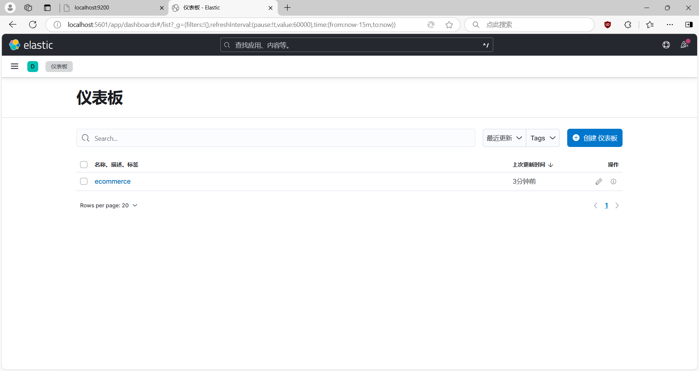

### 数据分析--1.统计每个产品类别的总销售额

### 示例图片--
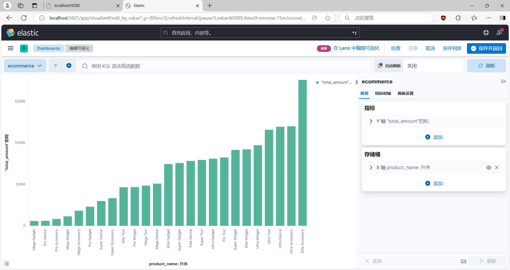
***

### 数据分析--2.计算每个城市的平均订单金额

### 示例图片--
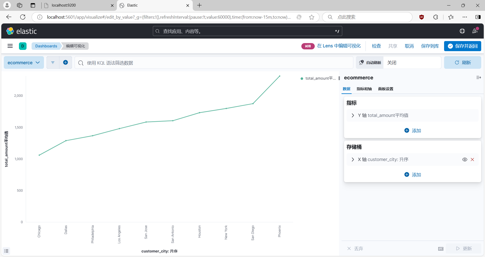
***

### 数据分析--3.找出销量最高的前5个产品

### 示例图片--
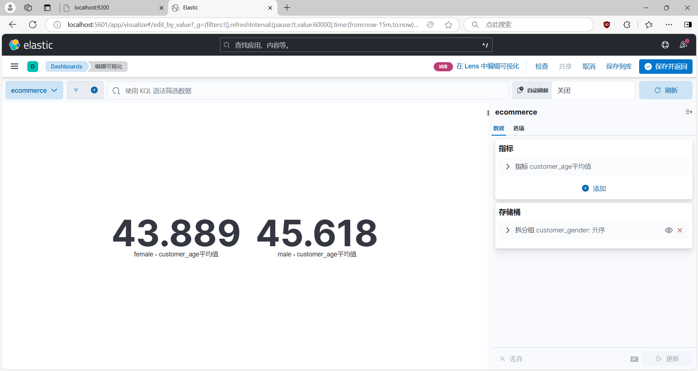
***

### 数据分析--4.计算男性和女性客户的平均年龄

### 示例图片--
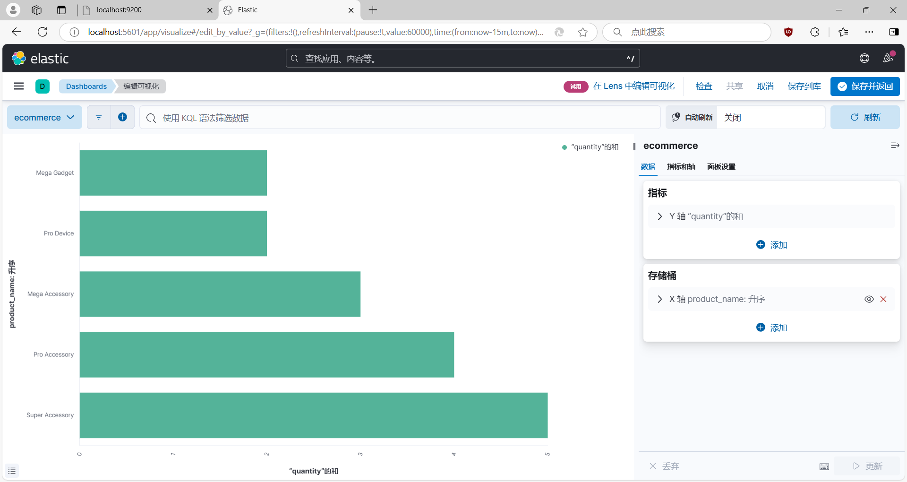
***

### 数据分析--5.统计每种支付方式的使用次数和总金额

### 示例图片--
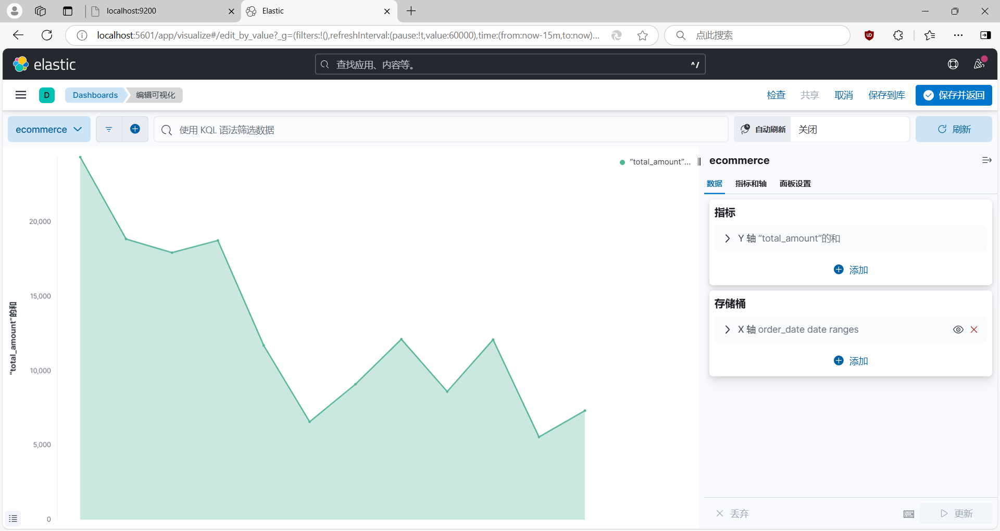
***

### 数据分析--6.计算每月的总销售额

### 示例图片--
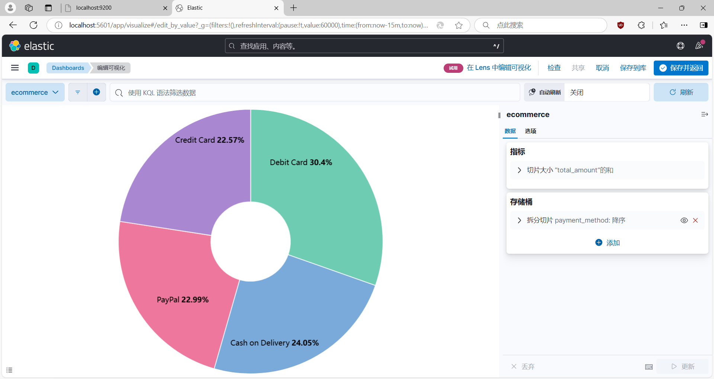
***

### 数据分析--7.找出平均订单金额最高的前3个客户

### 示例图片--
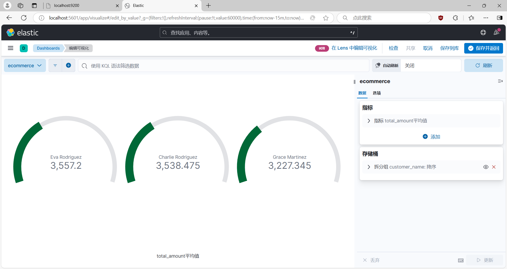
***

### 数据分析--8.计算每个年龄段（18-30，31-50，51+）的客户数量

### 示例图片--
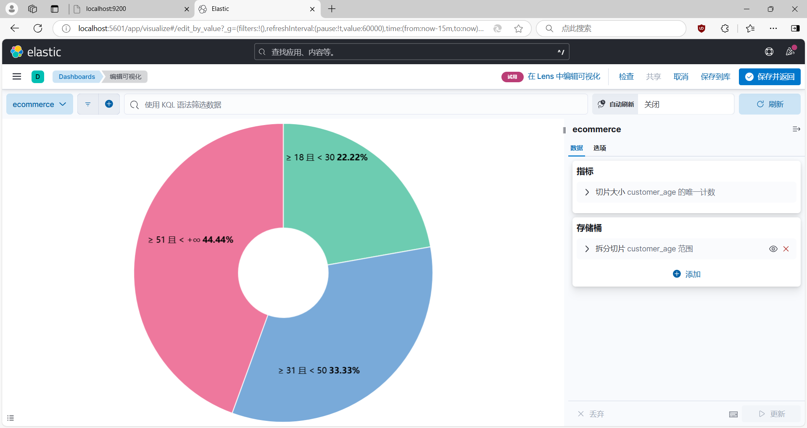
***

### 数据分析--9.计算每个产品类别的平均单价

### 示例图片--
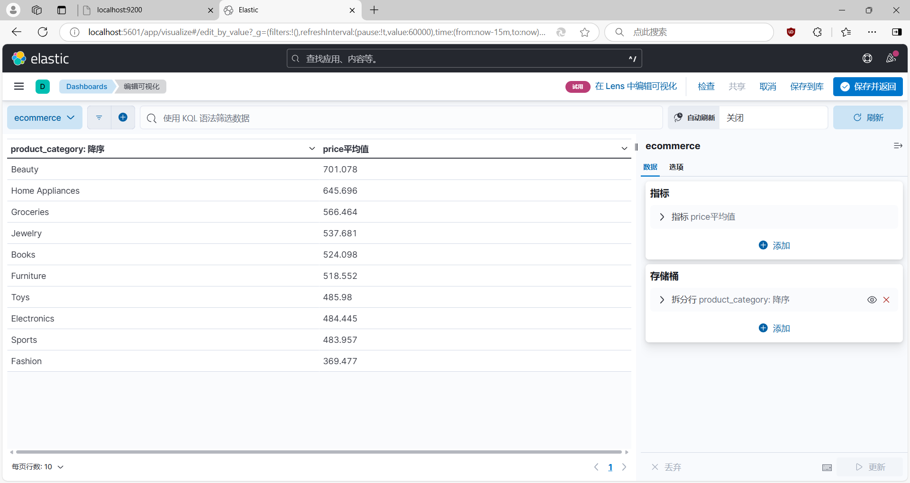
***

### 数据分析--10.找出订单数量最多的前5个城市

### 示例图片--
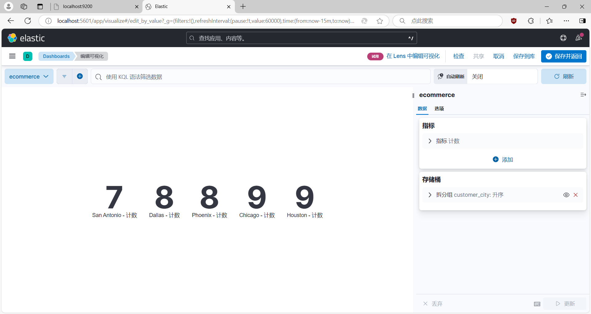

***
***
### 数据分析总览

### 示例图片--
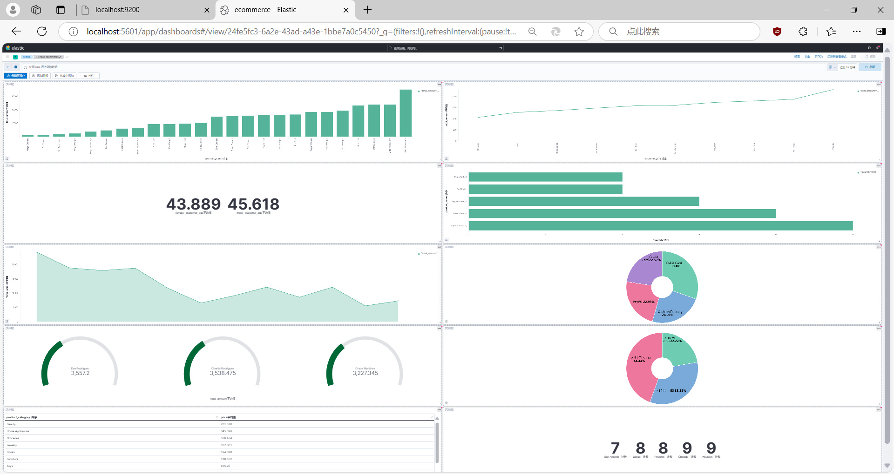

